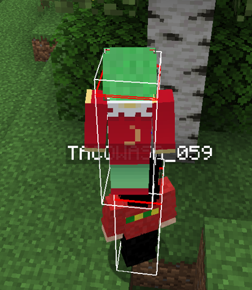

# 背中渡りmod



## 機能
- LivingEntityの上に乗れるmod
- ただし、乗っているエンティティの移動に従って、自動追従はしない。


## 動作環境
- minecraft 1.16.5
- forge 36.2.39

## 設定
- server.properties
```
allow-flight=true
```

## function
- Mod that allows you to ride on LivingEntity
- You do not automatically follow the movement of the riding entity.

## Environment
- minecraft 1.16.5
- forge 36.2.39

## Setting
- server.properties
```
allow-flight=true
```
